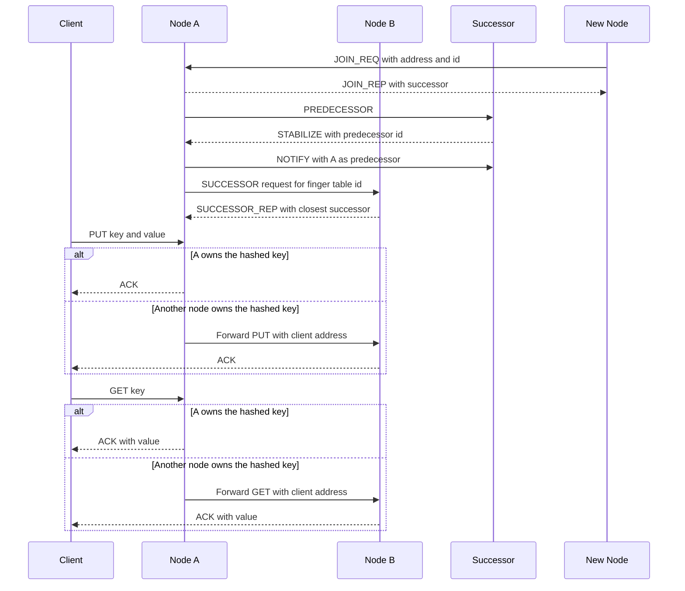

# Chord Distributed Hash Table

This repository contains the solved project for the second Distributed
Computing assignment at the University of Aveiro. The goal is to implement a
small distributed hash table using the Chord protocol.

The implementation creates a ring of UDP nodes that store key-value pairs. Each
node is responsible for a range of hashed keys, forwards requests for keys
owned by other nodes, and keeps a finger table so lookups can skip around the
ring instead of moving only to the immediate successor.

## Learning objectives

By completing this assignment, you should learn how to:

- organize nodes in a consistent-hashing ring;
- decide whether a key belongs to a node's responsibility interval;
- exchange protocol messages over UDP sockets;
- encode application messages with Pickle;
- insert and retrieve key-value pairs from a DHT;
- keep Chord successor and predecessor pointers stable; and
- use finger tables to improve remote lookup routing.

## Required functionality

The final solution supports:

- creation of a Chord ring with one or more nodes;
- joining new nodes through an existing DHT node;
- consistent hashing for node addresses and object keys;
- storage of key-value pairs on the responsible node;
- retrieval of values from any node in the ring;
- forwarding of `PUT` and `GET` requests when another node is responsible;
- periodic stabilization using predecessor and successor information;
- notification of successors so predecessor pointers stay current;
- finger table construction and refresh; and
- finger-table based forwarding for remote `PUT`, `GET`, and successor lookup.

All DHT messages run over UDP. Messages are Python dictionaries serialized with
Pickle before being sent on the socket.

## Chord ring and key ownership

Nodes and keys are mapped to integer identifiers with `dht_hash`. The ring uses
a 10-bit identifier space by default, so identifiers range from `0` to `1023`.

A node owns the interval after its predecessor up to and including its own
identifier:

```text
(predecessor_id, node_id]
```

Because the identifier space is circular, interval checks must also support the
wrap-around case where the predecessor has a larger identifier than the current
node. The `contains(begin, end, node)` helper implements this ring interval
logic.

## Protocol requirements

The DHT protocol uses these messages:

| Operation | Destination | Message |
| --- | --- | --- |
| Insert key-value pair | Any node | `{"method": "PUT", "args": {"key": key, "value": value}}` |
| Forward insert | Responsible node or next hop | `{"method": "PUT", "args": {"key": key, "value": value, "from": client_addr}}` |
| Insert response | Client | `{"method": "ACK"}` |
| Retrieve value | Any node | `{"method": "GET", "args": {"key": key}}` |
| Forward retrieve | Responsible node or next hop | `{"method": "GET", "args": {"key": key, "from": client_addr}}` |
| Retrieve response | Client | `{"method": "ACK", "args": value}` |
| Join ring | Any DHT node | `{"method": "JOIN_REQ", "args": {"addr": addr, "id": id}}` |
| Join response | New node | `{"method": "JOIN_REP", "args": {"successor_id": succ_id, "successor_addr": succ_addr}}` |
| Notify successor | Successor | `{"method": "NOTIFY", "args": {"predecessor_id": id, "predecessor_addr": addr}}` |
| Ask for predecessor | Successor | `{"method": "PREDECESSOR"}` |
| Stabilize response | Requesting node | `{"method": "STABILIZE", "args": pred_id}` |
| Ask for successor of id | Closest known node or successor | `{"method": "SUCCESSOR", "args": {"id": id, "from": addr}}` |
| Successor response | Requesting node | `{"method": "SUCCESSOR_REP", "args": {"req_id": req_id, "successor_id": succ_id, "successor_addr": succ_addr}}` |

## Expected interaction



## Supplied code

The repository is organized around a small set of modules:

```text
.
├── DHT.py                 # Starts a local Chord ring
├── DHTClient.py           # Client helper for PUT and GET operations
├── DHTNode.py             # Node, stabilization, routing, and finger tables
├── utils.py               # Hashing and ring interval helpers
├── requirements.txt       # Test dependencies
└── tests/                 # Automated tests
```

The main implementation lives in `DHTNode.py`. It includes:

- `FingerTable`, which stores successor shortcuts for each finger entry;
- `DHTNode.node_join`, which routes join requests to the correct predecessor;
- `DHTNode.stabilize`, which refreshes successor and finger table state;
- `DHTNode.put`, which stores or forwards key-value pairs; and
- `DHTNode.get`, which retrieves or forwards lookups.

`DHTClient.py` provides the client-facing `put(key, value)` and `get(key)`
methods. Clients can contact any node in the ring; the DHT routes the request to
the responsible node.

## Setup and tests

Create a virtual environment and install the test dependencies:

```sh
python3 -m venv .venv
source .venv/bin/activate
python -m pip install -r requirements.txt
```

Run the tests from the repository root:

```sh
python -m pytest -v
```

Some tests start real UDP nodes on localhost and wait for the ring to stabilize.
If a test run fails because a port is still in use, stop the previous process
and run the suite again.

## Running the DHT

Start the DHT in one terminal:

```sh
python3 DHT.py
```

By default this starts five nodes beginning at `localhost:5000`. You can change
the number of nodes and stabilization timeout:

```sh
python3 DHT.py --nodes 8 --timeout 2
```

In another terminal, use `DHTClient` to store and retrieve values:

```sh
python3 - <<'PY'
from DHTClient import DHTClient

client = DHTClient(("localhost", 5000))
client.put("A", [0, 1, 2])
print(client.get("A"))
PY
```

## Implementation checklist

- Ring interval checks handle both normal and wrap-around ranges.
- `PUT` stores values only on the responsible node.
- `GET` retrieves values from the responsible node.
- Forwarded requests preserve the original client address for the response.
- New nodes receive the correct successor during join.
- Stabilization updates successor and predecessor pointers.
- Finger tables refresh periodically.
- Remote lookups use finger table routing.
- All protocol messages are Pickle-encoded dictionaries over UDP.
- The automated test suite passes before submission.
